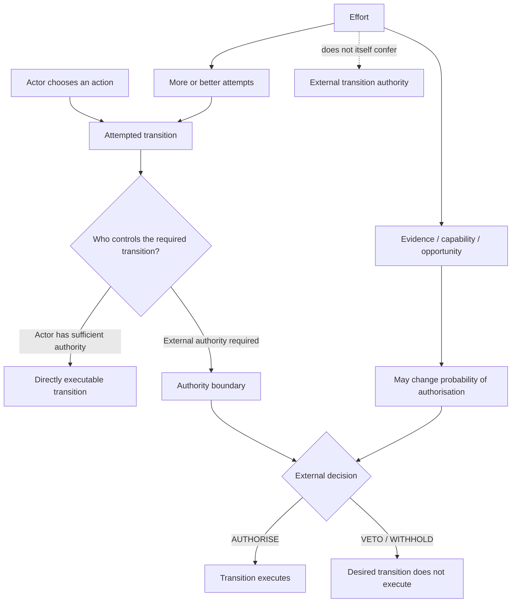
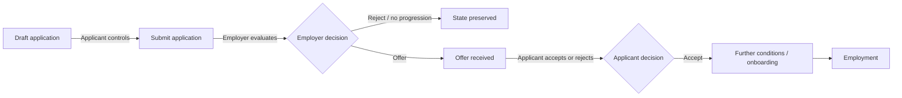
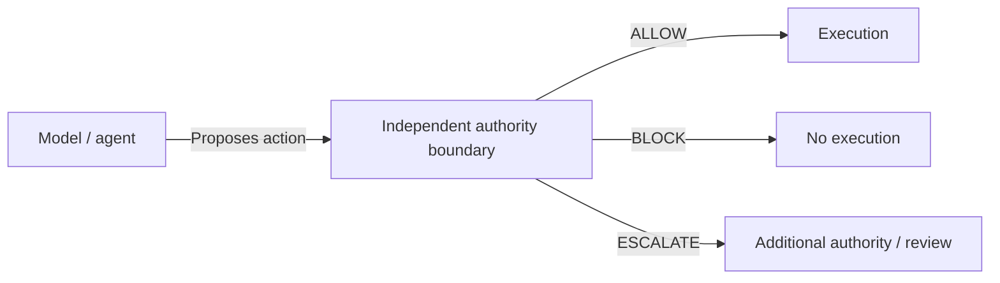

# Transition Authority

> **Effort determines which transitions you can attempt. Authority determines which transitions can execute.**

Transition Authority is a conceptual framework for reasoning about a simple but frequently collapsed distinction:

**the ability to take an action is not the same as authority over the resulting state transition.**

An actor may control what they propose, attempt, submit, build, request, or offer while another actor, institution, protocol, or system retains the authority required for the desired state change to occur.

This repository develops that distinction formally, tests where it is useful, and identifies where the model breaks down or becomes too simplistic.

---

## Core distinction

Consider a transition from state `x` to state `y`.

An actor may be able to initiate an action intended to move the system from `x` to `y` without possessing unilateral authority to make `y` occur.

```text
Action authority ≠ Transition authority
```

Examples:

| Domain | Attempt under the actor's control | Desired transition | Authority not held unilaterally by the actor |
|---|---|---|---|
| Employment | Submit an application | Applicant → Employee | Employer |
| Business | Send proposal / make offer | Prospect → Customer | Buyer / procurement |
| Finance | Submit credit request | Applicant → Credit issued | Lender |
| Regulation | Submit application | Applicant → Licensed | Regulator |
| AI systems | Propose tool action | Proposed action → Executed action | Execution-authorisation layer, where independently enforced |

The point is **not** that effort is irrelevant. Effort can change the number, quality, timing, and probability of attempted transitions.

The narrower claim is:

> **Effort cannot substitute for authority that the actor does not possess.**

---

## Transition-authority map



---

## A more precise example: employment

It is easy to say that a person either "controls" or "does not control" an employment outcome. The actual trajectory is more granular because authority changes across edges.



The useful question is therefore not merely:

> Who is acting?

It is:

> **Who possesses authority over each transition in the trajectory?**

---

## Veto authority

A veto is not merely advice, criticism, or a warning.

In this framework, **veto authority** means possessing the effective ability to withhold a transition through the relevant governed path.

```text
Proposal → Authority boundary → AUTHORISE → Execute
                              ↘ VETO      → Do not execute
```

This creates an important distinction:

```text
"You should not do this" ≠ "You cannot execute this through this authority boundary"
```

A warning represents a preference or constraint. A veto becomes consequential only when the architecture or institution gives the decision-maker effective authority over the transition.

---

## Structural deformation

A central concern of this project is **structural deformation**: a model is received, translated into a more familiar model, and materially changed in the process.

### Deformation 1: outcome → effort

Observed:

```text
Actor remains in state x
```

Possible deformation:

```text
No transition → insufficient effort
```

But the actual structure may be:

```text
Effort
  ↓
Repeated attempted transitions
  ↓
External authority boundary
  ↓
Authorisation repeatedly withheld
  ↓
State x persists
```

The persistence of a state therefore does **not, by itself, identify insufficient effort as the cause**.

### Deformation 2: authority → advice

Original structure:

```text
Actor proposes → Independent authority evaluates → Execution can be withheld
```

Deformed structure:

```text
Actor proposes → Safety system advises → Actor retains execution authority
```

These systems may look superficially similar while locating authority in fundamentally different places.

### Deformation 3: transition authority → determinism

Another possible mistake is to infer:

```text
External authority exists → actor's effort does not matter
```

That is also incorrect.

Effort, capability, evidence, timing, strategy, relationships, and other variables can materially change the probability of authorisation even when they do not confer unilateral transition authority.

---

## Attempt probability vs execution authority

A useful separation is:

```text
Effort → changes attempted transitions
Capability → changes quality of attempts
Strategy → changes selection of attempts
External authority → may permit or withhold required transitions
Environment → constrains which transitions are available
Outcome → emerges from their interaction
```

A rough conceptual expression is:

```text
Outcome = f(
  available actions,
  effort,
  capability,
  strategy,
  constraints,
  external authority,
  timing,
  uncertainty
)
```

This is deliberately **not** presented as a validated predictive equation. It is a decomposition of variables that the project can later formalise, challenge, and falsify.

---

## Authority dependency

A trajectory becomes **authority-dependent** when reaching a target state requires one or more transitions controlled by actors other than the initiating actor.

For example:

```text
Find decision-maker
      ↓
Send message
      ↓
[External authority: read / ignore]
      ↓
Receive reply
      ↓
[External authority: meet / decline]
      ↓
Present evidence
      ↓
[External authority: evaluate / reject]
      ↓
Propose pilot
      ↓
[External authority: authorise / decline]
      ↓
Pilot
```

Each additional discretionary authority boundary can create another point at which the trajectory terminates or stalls.

This suggests a practical design question:

> **Can a path to the desired state be redesigned to reduce unnecessary authority dependencies without removing legitimate safeguards?**

---

## Relationship to AI execution governance

Transition Authority is a general framework, not an AI-safety architecture.

However, the distinction has an obvious application to agentic systems.

An AI system may possess the ability to **propose** an action without possessing unilateral authority to **execute** the corresponding state transition.



The architectural question becomes:

> **Where does execution authority actually reside?**

This is related to, but intentionally separate from, the Morrison Runtime Governance work. Transition Authority is intended to explore the more general concept across technical, institutional, economic, and social systems.

---

## What this framework does *not* claim

Transition Authority does **not** claim that:

- people have no agency;
- effort is pointless;
- every unsuccessful outcome is caused by gatekeeping;
- external decision-makers are necessarily acting unfairly;
- possessing formal authority guarantees practical control;
- every transition has one identifiable decision-maker;
- social and economic systems can always be reduced to binary `ALLOW/BLOCK` decisions;
- the framework is already an empirically validated general theory of human outcomes.

These would be structural deformations or overextensions of the current idea.

The purpose of this repository is to make the distinctions explicit enough that they can be **tested rather than merely asserted**.

---

## Research questions

1. How should transition authority be formally represented?
2. When is authority unilateral, shared, delegated, distributed, conditional, or emergent?
3. How should probabilistic transitions be represented?
4. How do repeated authority boundaries affect reachability of a target state?
5. When does increasing effort materially increase transition probability, and when does it exhibit diminishing returns?
6. How can formal authority differ from effective or practical authority?
7. Can authority dependencies be measured?
8. Which apparent examples of transition authority disappear under closer causal analysis?
9. Under what conditions does the framework fail to explain observed outcomes?
10. Can the framework generate falsifiable predictions rather than retrospective explanations?

---

## Falsification standard

This project should not become a vocabulary for explaining every failure after the fact.

A useful theory must expose itself to counterexamples.

Evidence against a proposed Transition Authority model could include cases where:

- a supposedly external-authority-dependent transition can actually be executed unilaterally by the actor;
- the identified authority has no effective ability to change the transition;
- the transition occurs despite a purported effective veto;
- the model omits a necessary actor, state, dependency, or transition;
- changes in the proposed authority variable fail to produce the predicted differences;
- a simpler model explains the observed outcome equally well or better.

The objective is not to protect the framework.

**The objective is to discover where it survives reality.**

---

## Working propositions

### P1 — Action/transition distinction
Possessing the ability to initiate an action does not necessarily imply possessing authority over its intended state transition.

### P2 — Effort/authority distinction
Increasing effort may increase the quantity or quality of attempted transitions without conferring authority controlled by another actor or system.

### P3 — State-persistence ambiguity
Observing that an actor remains in the same state is insufficient, by itself, to infer insufficient effort.

### P4 — Edge-specific authority
Authority should be analysed at the level of individual transitions rather than assigned globally to an actor across an entire trajectory.

### P5 — Authority-dependency reduction
Where legitimate constraints permit it, reducing unnecessary external authority dependencies may increase an actor's ability to reach a target state.

These are working propositions to be refined or rejected as the project develops.

---

## Status

**Early conceptual work.**

The repository currently defines the initial vocabulary, diagrams, candidate propositions, deformation risks, and falsification questions. It should not yet be read as a completed mathematical theory or established empirical result.

---

## Author

**Davarn Morrison**  
Founder, Resurrection Tech Ltd

---

> **You may control what you propose without controlling whether the world authorises the transition.**
