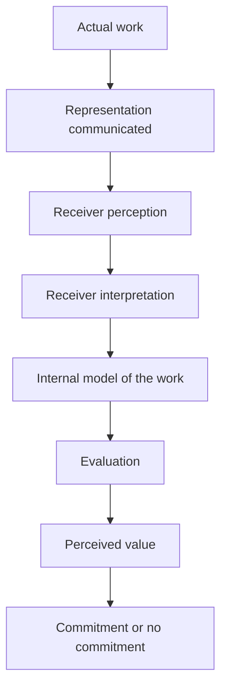
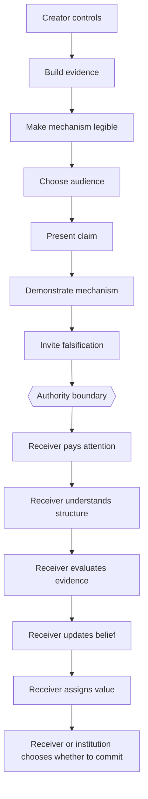

# Recognition and Transition Authority

## Why this file exists

Transition Authority is not only useful for analysing material transitions such as:

- applicant → employee
- prospect → customer
- founder → revenue-generating founder
- £0 → financial breathing room

It also helps explain a different class of transition that happens **before money, adoption, reputation, or fame**:

> **someone encountering work → someone recognising its value**

That transition is not directly controlled by the person who created the work.

The creator can control what they build, what evidence they produce, how they explain it, who they show it to, and how easy they make it to inspect.

They cannot directly authorise another person's understanding, belief update, valuation, or decision to act.

---

## Core proposition

> **You can control the evidence you present without controlling the observer's internal state transition.**

A useful decomposition is:



The critical point is that deformation can occur at multiple stages.

---

## Structural deformation

Structural deformation occurs when the receiver does not evaluate the original structure as presented, but instead substitutes a more familiar structure.

For example:

### Original structure

An agent proposes an action.

An independent authority evaluates whether that transition is admissible.

The authority can withhold execution.

### Deformed structure

"So this is basically another AI safety filter."

The listener has collapsed:

**independent transition authority**

into:

**advice, filtering, or policy representation**.

That is not merely a wording difference. It changes where authority resides in the architecture.

---

## Recognition is a transition in the observer

A creator may reasonably ask:

> "Why can't people see the value?"

But the structure is more granular than:

```text
valuable work → people see value
```

A more realistic path is:

```text
work exists
    ↓
receiver is exposed
    ↓
receiver pays attention
    ↓
receiver constructs an internal model
    ↓
receiver evaluates evidence
    ↓
receiver updates prior beliefs
    ↓
receiver assigns value
    ↓
receiver chooses whether to act
```

The creator can influence many of these transitions.

They do not directly control them.

---

## Four distinct gates

It is useful to separate at least four gates that are often collapsed into one.

### 1. Comprehension

Did the receiver understand the actual mechanism?

A useful test is whether they can explain the structure back accurately.

If they cannot, valuation has not yet been tested cleanly because they may be evaluating a distorted model.

### 2. Belief update

Did the evidence change what the receiver believes?

A person may understand the mechanism perfectly and still think the evidence is weak.

That is different from misunderstanding.

### 3. Valuation

Does the receiver believe the demonstrated capability solves a problem that matters?

A person may accept the evidence and still conclude:

> "This works, but I do not think this problem matters enough for us."

That is a genuine valuation disagreement, not necessarily structural deformation.

### 4. Commitment

Will the receiver spend something scarce on that valuation?

Examples include:

- time
- reputation
- engineering effort
- access to an environment
- budget
- procurement effort
- political or organisational capital

A receiver may understand, believe, and value the work while still lacking authority to commit the organisation.

---

## Transition map



The left side is mostly under the creator's authority.

The right side is influenced by the creator but not directly controlled by them.

---

## A key anti-deformation rule

A dangerous interpretation would be:

> "If people do not recognise the work, they simply failed to understand it."

That would make the framework unfalsifiable.

The correct structure is:

```text
No recognition
    ↓
Could be misunderstanding
OR
Could be weak evidence
OR
Could be low perceived relevance
OR
Could be low trust
OR
Could be poor timing
OR
Could be genuine disagreement
OR
Could be lack of institutional authority
```

Therefore:

> **Absence of recognition does not prove absence of value.**

But also:

> **Absence of recognition does not prove value either.**

The job is to identify which transition failed.

---

## Recognition and reputation

Reputation changes the transition topology.

An unknown creator may need to cross several high-friction gates:

```text
attention → trust → comprehension → belief update → valuation
```

A well-known institution may begin with stronger priors of credibility and therefore face lower friction at some of those gates.

This does not necessarily mean the underlying work is better.

It means the observer enters the evaluation process with a different prior state.

A useful distinction is:

```text
Value(work) ≠ Recognition(work)
```

Recognition can be represented conceptually as a function of several variables:

```text
Recognition = f(
    exposure,
    attention,
    comprehension,
    priors,
    evidence,
    trust,
    incentives,
    timing,
    context
)
```

This is a conceptual model, not yet a validated empirical equation.

---

## Why demonstrations matter

Claims written at a high level are easy to deform.

For example:

> "We provide safer AI runtime governance."

A listener can map that phrase into almost any familiar category.

A concrete sequence is harder to deform:

```text
unsafe transition proposed
        ↓
independent authority evaluates
        ↓
transition denied
        ↓
action cannot execute through governed path
```

Evidence constrains interpretation.

The more directly the observer can inspect the actual transition structure, the fewer degrees of freedom remain for category substitution.

---

## Diagnostic framework

When a person or institution does not act, ask these questions in order:

1. **Exposure** — did they actually encounter the work?
2. **Attention** — did they meaningfully inspect it?
3. **Comprehension** — can they describe the mechanism accurately?
4. **Evidence** — do they accept that the evidence supports the bounded claim?
5. **Valuation** — do they think the problem and capability matter?
6. **Authority** — can they personally authorise the next transition?
7. **Commitment** — are they willing to spend scarce resources to do so?

Different failures require different responses.

A comprehension failure should not be treated as a pricing problem.

A valuation failure should not be treated as a messaging problem without evidence.

An authority failure should not be mistaken for lack of interest.

---

## Relation to Transition Authority

The general Transition Authority model says:

> **Action authority does not imply transition authority.**

This file extends that idea into recognition and evaluation.

A creator may possess authority to:

- build
- explain
- demonstrate
- publish
- contact
- invite inspection
- provide evidence

But they do not possess unilateral authority over:

- another person's attention
- another person's comprehension
- another person's belief update
- another person's valuation
- another institution's commitment

Those are separate transitions with separate authorities and dependencies.

---

## Working principle

> **You can make recognition easier, more probable, and more faithful. You cannot directly authorise another person's recognition.**

That distinction matters because it prevents two opposite structural deformations:

### Deformation A

> "If they did not recognise the value, the work must have no value."

Not necessarily.

### Deformation B

> "If they did not recognise the value, they must have misunderstood it."

Also not necessarily.

The correct question is:

> **Which transition failed, who held authority over that transition, and what evidence distinguishes misunderstanding from genuine disagreement?**

---

## Open questions

This extension raises several research questions:

- Can structural deformation be detected reliably?
- Can comprehension be operationalised through accurate mechanism reconstruction?
- How should attention, trust, prior beliefs, and institutional incentives be represented?
- Can recognition pathways be modelled as state-transition systems without oversimplifying human cognition?
- How do reputation and institutional prestige alter transition probabilities?
- What evidence distinguishes a comprehension failure from a valuation failure?
- When does a receiver understand and value work but still lack authority to act?
- Can communication be designed to minimise category substitution?

---

## Status

This document is early conceptual work.

It is intended to make the structure testable rather than to provide an unfalsifiable explanation for why recognition has or has not occurred.

The framework should be refined through counterexamples, empirical observation, and cases where people understand the work accurately yet still reject its value.
