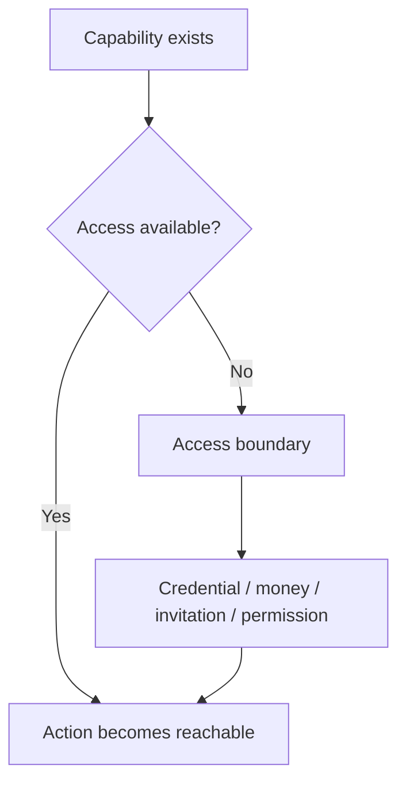
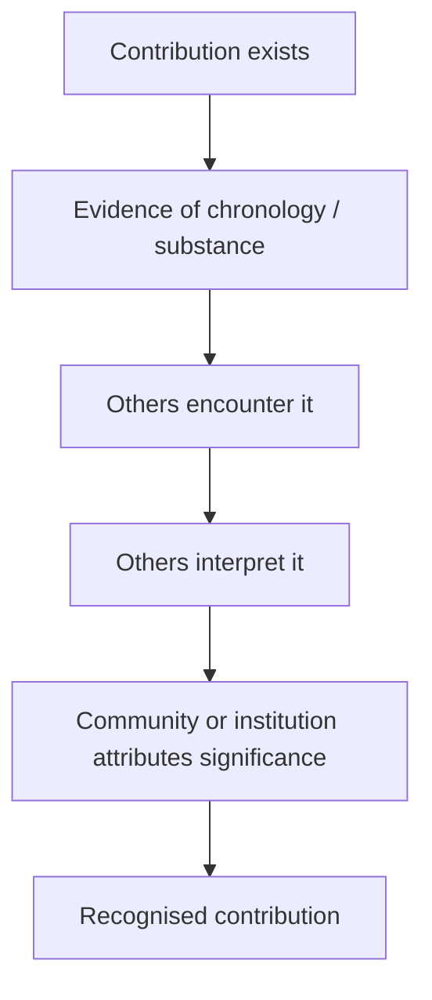
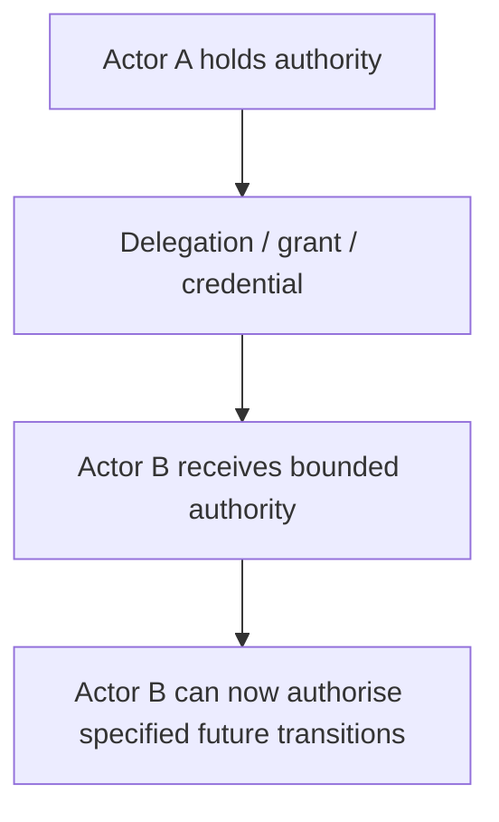
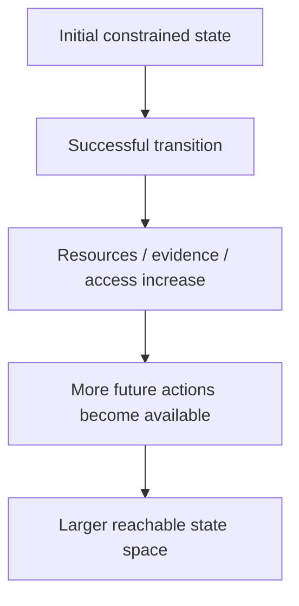
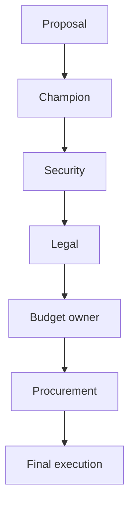
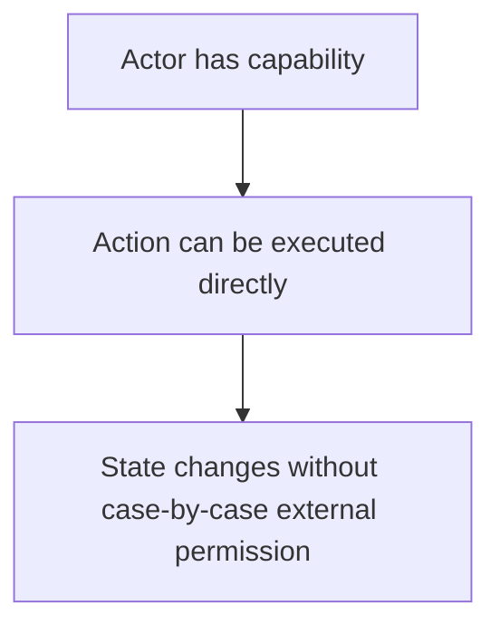

# Transition Patterns

This note extends the **Transition Authority** idea beyond employment, sales, and direct buying decisions.

The central question is:

> **Who controls whether a state transition can execute, and how does that distribution of authority shape what is reachable?**

A key distinction throughout this repository is:

> **Action authority is not transition authority.**

An actor may be able to attempt, propose, request, signal, publish, apply, or prepare a transition without controlling whether the target state becomes reachable.

---

## 1. Access transitions

A person can possess the capability to perform an action without possessing access to the state in which that action is possible.



### Core proposition

> **Capability does not imply reachability when access is externally governed.**

Examples include:

- access to an enterprise environment;
- access to compute or specialist infrastructure;
- access to an event or programme;
- access to a production system;
- access to funding;
- access to credentials or APIs;
- access to external testing environments.

### Structural deformation

**Deformed interpretation:** if a person cannot perform the action, they must lack capability.

**Actual structure:** the capability may exist while the relevant state remains unreachable because an access boundary is controlled elsewhere.

---

## 2. Recognition transitions

Recognition is not identical to value, chronology, truth, or technical merit.

A contribution can exist before it is socially recognised.



### Core proposition

> **Recognition is a transition in the observer or social system, not merely a property of the object being recognised.**

A timestamp can establish that something existed at time `T`.

It cannot, by itself, authorise the social transition:

`unrecognised contribution -> recognised contribution`

### Structural deformation

Avoid both of these:

- **"It was not recognised, therefore it had no value."**
- **"It was not recognised, therefore everyone must have misunderstood it."**

Neither conclusion follows automatically.

---

## 3. Authority-transfer transitions

Some transitions do more than change system state. They change **who controls future transitions**.



Examples:

- an employee receives privileged system access;
- a developer receives production credentials;
- a bank grants a credit facility;
- an administrator receives approval rights;
- an execution-governance layer receives bounded veto authority over specified actions.

### Core proposition

> **Some transitions modify the future distribution of authority, not merely the present state.**

This matters because an authority-transfer transition can alter the entire future reachable state space.

---

## 4. Irreversible transitions

Not every transition has a simple inverse.

```text
X -> Y
```

does not imply:

```text
Y -> X
```

Examples:

- information is disclosed;
- a payment settles;
- a message is sent;
- a production action changes an external system;
- a destructive operation is executed;
- a public statement is released.

The reverse transition may be impossible, incomplete, costly, delayed, or controlled by a different authority.

### Core proposition

> **The value of pre-execution authority rises as the cost or impossibility of reversal increases.**

One useful way to represent this is to assign an **irreversibility cost** to edges in a transition graph.

For a transition:

\[
T(x,a)=x'
\]

it may be the case that no practical inverse exists:

\[
T^{-1}(x') \notin A
\]

or that reversal requires an entirely different authority structure.

---

## 5. Authority accumulation

Some successful transitions expand the set of transitions available afterwards.



Examples:

```text
first revenue
-> equipment
-> greater productive capability
-> more delivery capacity
-> more revenue
```

or:

```text
first customer
-> evidence
-> trust
-> easier subsequent sale
```

### Transition leverage

A useful concept is:

> **Transition leverage:** the degree to which one executed transition changes the reachability, probability, cost, or authority structure of many later transitions.

A high-leverage transition is valuable not only for its immediate outcome, but because it alters the topology of what becomes possible next.

---

## 6. Compound veto structures

Many real systems are not controlled by a single authority.

They contain sequential or parallel decision points.



The important distinction is:

> **An individual veto is not the same as a structurally low-probability path.**

A transition can fail even when no single actor strongly opposes it.

The path itself may contain so many serial dependencies that execution becomes unlikely, slow, or fragile.

### Structural deformation

**Deformed interpretation:** "The company rejected it."

**Possible actual structure:** one unit supported it, another approved it, budget was unavailable, and procurement stalled.

An organisation is often better modelled as a **multi-authority transition system** than as a single actor.

---

## 7. Permissionless transitions

Some systems deliberately reduce discretionary veto points.



Examples may include:

- publishing to a public repository;
- building locally with open tools;
- distributing research publicly;
- shipping a small self-service product;
- using an open protocol instead of a permissioned gatekeeper.

No transition is literally free of all constraints. Infrastructure, law, access, identity, and platform rules still matter.

But some paths contain **fewer discretionary external edges** than others.

### Strategic proposition

Given a current state `x` and desired state `y`, consider paths that minimise unnecessary external authority dependencies while preserving acceptable risk, cost, and quality.

A useful abstract objective is:

\[
P^* = \arg\min_P \sum_{e \in P} d(e)
\]

where `d(e)` represents the discretionary external dependency associated with edge `e`.

This can be extended with weights for:

- delay;
- trust requirements;
- probability of rejection;
- bureaucracy;
- reversibility;
- capital requirements;
- number of independent authorities involved.

This is a heuristic, not yet a validated general metric.

---

# Transition categories worth separating

The framework becomes clearer if different kinds of transition are not collapsed into one category.

### Permission transitions

A state change depends on another actor granting permission.

Example:

`application -> access granted`

### Recognition transitions

A state change occurs in another observer's interpretation or social attribution.

Example:

`unknown work -> recognised work`

### Coordination transitions

Multiple actors must align before execution becomes possible.

Example:

`proposal -> approved deployment`

### Resource transitions

A change in money, compute, equipment, time, or infrastructure changes what is reachable.

Example:

`insufficient capital -> sufficient capital`

### Authority-transfer transitions

A transition changes who controls future edges.

Example:

`no production authority -> bounded production authority`

### Irreversible transitions

Execution changes the system in a way that cannot simply be undone.

Example:

`unsent message -> sent message`

### Permissionless transitions

A path has been designed to minimise discretionary case-by-case permission.

Example:

`finished research -> public repository`

---

# A broader optimisation view

Transition Authority can be used descriptively:

> Why did a transition fail even though an actor exerted substantial effort?

But it can also be used prescriptively:

> **Can the path be redesigned so that fewer critical edges depend on external discretionary authority?**

That turns the framework into a path-design problem.

For multiple possible routes from `x` to `y`, compare:

- number of externally controlled edges;
- number of sequential veto points;
- reversibility of each edge;
- cost of failure;
- delay introduced by each authority;
- whether authority can be delegated;
- whether one transition expands future reachable states;
- whether the same objective can be reached through a lower-dependency path.

The goal is not to eliminate interdependence.

The goal is to understand **where authority lives**, identify unnecessary dependencies, and distinguish effort from the power to execute state change.

---

# Relationship to Morrison Runtime Governance

These concepts are related to, but distinct from, Morrison Runtime Governance.

A useful separation is:

> **Morrison asks:** Which transitions should an actor be permitted to execute within a governed environment?

> **Transition Authority asks:** Who controls whether a transition can execute, how is that authority distributed, and how does that distribution affect reachability?

Collapsing those questions would be a structural deformation.

They overlap around authority, reachability, and transition control, but they are not the same framework.

---

# Working principle

The strongest general formulation remains:

> **Effort determines which transitions you can attempt. Authority determines which transitions can execute.**

A further extension is:

> **High-leverage transitions are valuable because they change not only the current state, but the authority, resources, or reachability of future states.**
